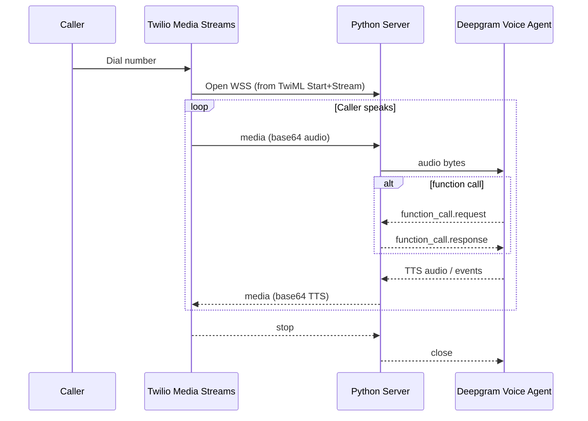
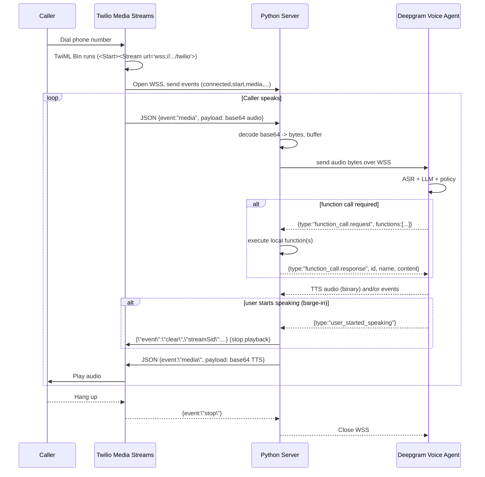

# Python AI Voice Agent (Deepgram + Twilio, WebSockets, Function Calling)

Build a **fast, reliable, real-time** voice agent you can call from any phone.  
This project connects a **Twilio** phone number to a local **Python** server, streams audio over **WebSockets**, and uses **Deepgram’s Voice Agent API** for **ASR** (speech→text), **LLM “think”**, **TTS** (text→speech), **barge-in**, and **function calling**.

> **What you get**
> - Phone-callable AI voice assistant
> - Near real-time latency with barge-in and turn-taking
> - Tool/Function calling to execute your business logic
> - Clean, extensible Python architecture (async, queues, sockets)

---

## Table of Contents

- [Features](#features)  
- [Architecture & Pipeline](#architecture--pipeline)  
- [Call Flow (Sequence Diagram)](#call-flow-sequence-diagram)  
- [Repository Structure](#repository-structure)  
- [Prerequisites](#prerequisites)  
- [Quick Start](#quick-start)  
- [Configuration](#configuration)  
  - [.env](#env)  
  - [`config.json`](#configjson)  
  - [Function Map & Tool Calls](#function-map--tool-calls)  
- [Runtime Internals](#runtime-internals)  
- [Twilio Setup Details](#twilio-setup-details)  
- [Development vs Production](#development-vs-production)  
- [Security Notes](#security-notes)  
- [Troubleshooting](#troubleshooting)  
- [FAQ](#faq)  
- [License](#license)

---

## Features

- **Telephony integration** with Twilio (PSTN, SIP, WhatsApp, WebRTC).
- **Real-time streaming** audio over **WebSockets**.
- **Deepgram Voice Agent API**:
  - High-accuracy **ASR**
  - Natural **TTS**
  - **Barge-in** (interrupt the agent naturally)
  - **Function Calling** with JSON schemas
  - Pluggable **LLM provider** (e.g., OpenAI) via config
- **Python asyncio** design:
  - Separate **sender/receiver** loops
  - **Queues** for audio backpressure
  - Clean **event** handling

---

## Architecture & Pipeline





**Roles**
- **Twilio**: phone number, call routing, **WebSocket Media Stream** to your server; plays your returned TTS.
- **Your Server**: the **bridge**—moves audio both ways, handles events, executes functions.
- **Deepgram**: agent runtime (ASR + LLM “think” + TTS + barge-in + function calling).

---

## Call Flow (Sequence Diagram)


---

## Repository Structure

```
voice-agent/
├─ main.py                  # Async server: Twilio <-> Deepgram bridge
├─ config.json              # Deepgram Voice Agent configuration
├─ pharmacy_functions.py    # Example business functions & function_map
├─ .env.example             # Template for secrets
├─ README.md                # This file
└─ requirements.txt         # Or use uv/pyproject.toml
```

---

## Prerequisites

- **Python 3.10+**
- One of:
  - `uv` (recommended) or
  - `pip` + `venv`
- **Twilio** account (trial works; verify your mobile for outbound tests)
- **Deepgram** account + API key
- **ngrok** (for local development tunneling)

---

## Quick Start

### 1) Clone & create environment
```bash
git clone https://github.com/<you>/voice-agent.git
cd voice-agent

# Option A: uv (fast)
uv venv
source .venv/bin/activate
uv pip install -r requirements.txt

# Option B: pip
python -m venv .venv
source .venv/bin/activate
pip install -r requirements.txt
```

`requirements.txt` (example):
```txt
websockets
python-dotenv
```

### 2) Configure secrets
Copy `.env.example` → `.env` and fill values:
```env
DEEPGRAM_API_KEY=dg_xxx...
OPENAI_API_KEY=sk-...        # optional if using OpenAI as think provider
```

### 3) Deepgram Agent config
Open `config.json` and adjust:
- voice model, transcription model
- `agent.think` provider/model
- `prompt` and `greeting`
- **functions** array (tool definitions)

(Example config below.)

### 4) Start your local server
```bash
python main.py
# prints: "started server" on ws://localhost:5000 (or similar)
```

### 5) Expose via ngrok
In a different terminal:
```bash
ngrok http 5000
```
Grab the **public host** (e.g., `example.ngrok-free.app`). You’ll use it **with `wss://`** in TwiML.

### 6) Twilio phone number → TwiML Bin
Create a **TwiML Bin** and paste:

```xml
<Response>
  <Say>This call may be monitored or recorded.</Say>
  <Start>
    <Stream url="wss://YOUR-NGROK-HOST.ngrok-free.app/twilio"/>
  </Start>
</Response>
```

Attach this TwiML Bin to your **phone number** under Voice settings (“When a call comes in”).

### 7) Call your number
- If on Twilio trial, **verify your personal phone** first.
- Call the number—your agent should greet you and respond in real time.

---

## Configuration

### .env
- `DEEPGRAM_API_KEY` – required
- `OPENAI_API_KEY` – optional, if you configure OpenAI as the think model
- Add any of your **tool backends** secrets here (e.g., DB URL)

### `config.json`

**Minimal example** (trim as needed; adjust models/voices):

```json
{
  "type": "settings",
  "audio": {
    "input_encoding": "linear16",
    "output_encoding": "linear16"
  },
  "agent": {
    "language": "en",
    "speaking": {
      "provider": "deepgram",
      "model": "aura-asteria-en"
    },
    "transcription": {
      "provider": "deepgram",
      "model": "nova-3"
    },
    "think": {
      "provider": "openai",
      "model": "gpt-4o-mini"
    },
    "prompt": "You are a professional pharmacy assistant. ...",
    "greeting": "Hello! I can help with drug information, placing orders, and checking status.",
    "functions": [
      {
        "name": "get_drug_info",
        "description": "Get details/price for a specific drug.",
        "parameters": {
          "type": "object",
          "properties": {
            "drug_name": {
              "type": "string",
              "description": "Drug to lookup (lowercase)."
            }
          },
          "required": ["drug_name"]
        }
      },
      {
        "name": "place_order",
        "description": "Create an order for a drug.",
        "parameters": {
          "type": "object",
          "properties": {
            "customer_name": { "type": "string" },
            "drug_name": { "type": "string" }
          },
          "required": ["customer_name", "drug_name"]
        }
      },
      {
        "name": "lookup_order",
        "description": "Lookup an existing order by ID.",
        "parameters": {
          "type": "object",
          "properties": {
            "order_id": { "type": "integer" }
          },
          "required": ["order_id"]
        }
      }
    ]
  }
}
```

**Key fields**
- `audio.*`: input/output codec for streaming
- `agent.transcription`: ASR model/provider
- `agent.speaking`: TTS model/provider (voice)
- `agent.think`: LLM used by the agent for reasoning
- `agent.functions`: the **tool contract** (names, descriptions, JSON schemas)

### Function Map & Tool Calls

Implement your business logic in `pharmacy_functions.py` and register the functions:

```python
# pharmacy_functions.py
orders_db = {}
next_id = 1

def get_drug_info(drug_name: str):
    # ...lookup in a dict/DB and return a dict result

def place_order(customer_name: str, drug_name: str):
    global next_id
    # ...create and store order, return order details

def lookup_order(order_id: int):
    # ...return order details or error

function_map = {
    "get_drug_info": get_drug_info,
    "place_order": place_order,
    "lookup_order": lookup_order,
}
```

The server:
- Parses `function_call.request` from Deepgram (name, id, arguments JSON).
- Executes `function_map[name](**arguments)`.
- Returns `function_call.response` to Deepgram (id, name, serialized content).

---

## Runtime Internals

Your server uses **three concurrent loops** (asyncio):

1. **Twilio Receiver**  
   - Reads **JSON events** (`connected`, `start`, `media`, `stop`).
   - On `media` with inbound audio: base64-decode → **bytes** → **buffer**.
   - When buffer ≥ chunk size → **enqueue bytes** to `audio_queue`.

2. **Deepgram Sender**  
   - Waits on `audio_queue`; sends **raw bytes** to Deepgram over WSS.

3. **Deepgram Receiver**  
   - If **text (JSON)**:
     - `user_started_speaking` → send {\"event\":\"clear\",\"streamSid\":...} to Twilio (barge-in).
     - `function_call.request` → run functions → send `function_call.response`.
   - If **binary**: TTS audio bytes → base64 encode → send as Twilio `media` event for playback.

**Why queues?**  
They provide **backpressure** and decouple Twilio ingestion rate from Deepgram transmission rate.

---

## Twilio Setup Details

### TwiML Bin
```xml
<Response>
  <Say>This call may be monitored or recorded.</Say>
  <Start>
    <Stream url="wss://YOUR-NGROK-HOST.ngrok-free.app/twilio"/>
  </Start>
</Response>
```

- Attach the Bin to your **Phone Number → Voice → “When a call comes in”**.
- Use `**wss://**` (secure WebSockets).
- On Twilio trial: **verify** your test phone number (Phone Numbers → Verified Caller IDs).

### Events You’ll Receive
- `connected`
- `start` (includes `streamSid`)
- `media` (base64 audio payload, `track` “inbound” or “outbound”)
- `stop`

### Events You Can Send
- `media` (base64 audio payload to play)
- `clear` (stop current playback—used for **barge-in**)

---

## Development vs Production

**Development**
- Use **ngrok** to expose `localhost:5000` quickly.
- Expect the ngrok URL to change on restart—**update TwiML** if so.

**Production**
- Deploy your server behind **HTTPS/WSS** with a valid certificate.
- Options:
  - VM + **systemd** + **Caddy/Nginx** reverse proxy
  - **Docker**/**Kubernetes** (health checks on the WS endpoint)
- Ensure:
  - Low-latency region close to Twilio/Deepgram POPs
  - Process supervision & log rotation
  - Metrics/observability (see below)

**Observability**
- **Twilio**: Console → **Monitor → Debugger**, Media Streams logs
- **Deepgram**: Dashboard → **Voice Agent sessions**, latency/turns
- **App logs**: log function calls, barge-ins, streamSid, chunk sizes

---

## Security Notes

- **Never commit** `.env` or API keys; add to `.gitignore`.
- Use **TLS/WSS** end-to-end in production.
- Sanitize and validate **function call arguments**.
- Be cautious with PII/PHI; assess regulatory requirements (e.g., HIPAA).
- Implement **rate limiting** and **auth** if you expose additional endpoints.

---

## Troubleshooting

**No audio / dead air**
- Check TwiML uses `wss://` and the correct **ngrok host**.
- Confirm your server prints “started server” and handles incoming connections.

**Trial restrictions**
- Outbound to **unverified** numbers is blocked—verify your phone in Twilio.

**Base64 errors**
- Ensure you’re decoding `media.payload` and only processing `track == "inbound"` for ASR.
- When sending back to Twilio, use **base64-encoded bytes** as `media.payload`.

**High latency**
- Reduce buffer size for smaller audio chunks (trade-off: overhead).
- Keep your server close to Twilio/Deepgram regions.
- Avoid synchronous/blocking work in the event loops.

**Barge-in not working**
- Make sure you act on Deepgram `user_started_speaking` by sending Twilio {\"event\":\"clear\"} with the correct `streamSid`.

**ngrok URL changed**
- Update the TwiML Bin’s Stream URL.

---

## FAQ

**Does Twilio talk to Deepgram directly?**  
No. Twilio ↔ **your server** ↔ Deepgram. Your server is the bridge.

**Is this using LangChain/LangGraph?**  
No framework is required. Deepgram’s Voice Agent handles orchestration; your Python code wires sockets and executes functions.

**Can I use a different LLM?**  
Yes. Configure `agent.think` (provider/model) in `config.json` and provide necessary API keys in `.env`.

**Can I change the voice?**  
Yes. Switch `agent.speaking.model` to a voice supported by Deepgram.

---

## License

Add your preferred license (e.g., MIT) here.

---

### Appendix: Minimal Server Skeleton (for reference)

```python
# main.py
import asyncio, json, base64, os, websockets
from dotenv import load_dotenv
from pharmacy_functions import function_map

load_dotenv()
DG_KEY = os.getenv("DEEPGRAM_API_KEY")

DG_WSS = "wss://agent.deepgram.com/v1/agent/converse"

async def dg_connect():
    # Subprotocols can carry auth: ["token:<API_KEY>"] (depends on SDK/version)
    return await websockets.connect(DG_WSS, subprotocols=[f"token:{DG_KEY}"])

def create_fn_response(fid, fname, result):
    return {"type":"function_call.response","id":fid,"name":fname,"content":json.dumps(result)}

async def execute_fn(name, args):
    if name in function_map:
        return function_map[name](**args)
    return {"error": f"unknown function: {name}"}

async def dg_sender(dg_ws, audio_q):
    while True:
        chunk = await audio_q.get()
        await dg_ws.send(chunk)

async def dg_receiver(dg_ws, twilio_ws, stream_sid):
    async for msg in dg_ws:
        if isinstance(msg, str):
            decoded = json.loads(msg)
            t = decoded.get("type")
            if t == "user_started_speaking":
                await twilio_ws.send(json.dumps({"event":"clear","streamSid":stream_sid}))
            elif t == "function_call.request":
                for fn in decoded.get("functions", []):
                    args = json.loads(fn["arguments"])
                    result = await execute_fn(fn["name"], args)
                    await dg_ws.send(json.dumps(create_fn_response(fn["id"], fn["name"], result)))
        else:
            # binary TTS -> Twilio media
            payload = base64.b64encode(msg).decode("ascii")
            await twilio_ws.send(json.dumps({"event":"media","streamSid":stream_sid,"media":{"payload":payload}}))

async def twilio_receiver(twilio_ws, audio_q, sid_q):
    buf, BUF = bytearray(), 20*160
    async for m in twilio_ws:
        data = json.loads(m)
        ev = data.get("event")
        if ev == "start":
            await sid_q.put(data["start"]["streamSid"])
        elif ev == "media":
            if data.get("media") and data.get("track") in (None, "inbound"):
                buf.extend(base64.b64decode(data["media"]["payload"]))
                while len(buf) >= BUF:
                    chunk, buf = bytes(buf[:BUF]), buf[BUF:]
                    await audio_q.put(chunk)
        elif ev == "stop":
            break

async def twilio_handler(twilio_ws):
    audio_q = asyncio.Queue()
    sid_q   = asyncio.Queue()
    async with (await dg_connect()) as dg_ws:
        # send config first
        with open("config.json") as f:
            await dg_ws.send(json.dumps(json.load(f)))

        # start loops
        rec_sid = asyncio.create_task(sid_q.get())
        loops = [
            asyncio.create_task(dg_sender(dg_ws, audio_q)),
            asyncio.create_task(twilio_receiver(twilio_ws, audio_q, sid_q))
        ]
        stream_sid = await rec_sid
        loops.append(asyncio.create_task(dg_receiver(dg_ws, twilio_ws, stream_sid)))

        await twilio_ws.wait_closed()
        for t in loops: t.cancel()

async def main():
    async def handler(ws, path):
        if path == "/twilio":  # WSS route matching your TwiML Stream URL
            await twilio_handler(ws)

    async with websockets.serve(handler, "0.0.0.0", 5000):
        print("started server :5000")
        await asyncio.Future()

if __name__ == "__main__":
    asyncio.run(main())
```
